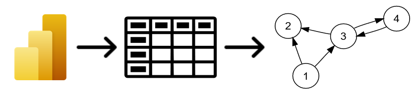
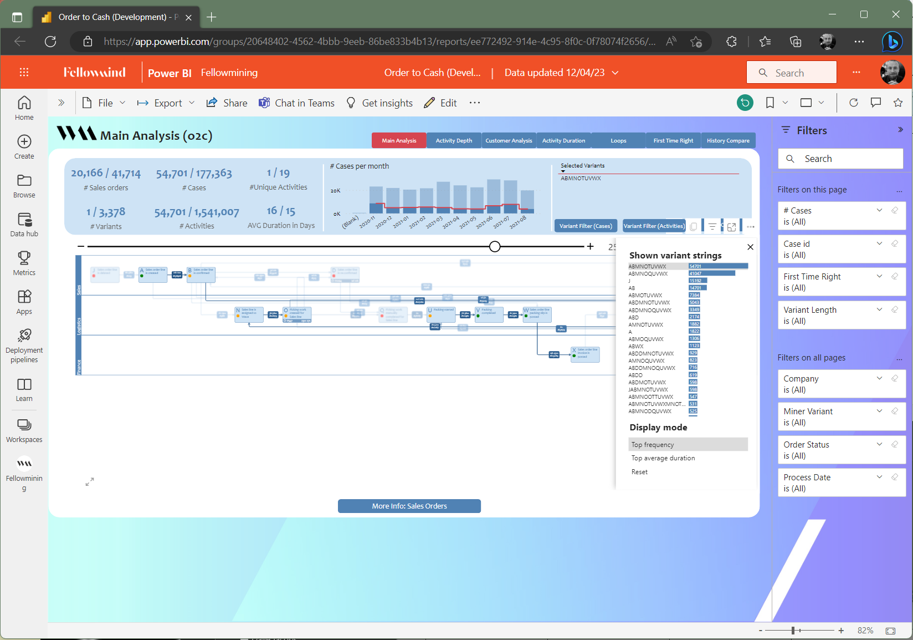

Baantjes trekken met PowerBI, D3 en een Direct Follow Graph
-----------------------------------------------------------

# How did i get here!
Ik wil graag iets vertellen over hoe ik begin vorige jaar verwikkeld ben geraakt in het [**Fellowmining**](https://www.fellowmindcompany.com/nl-nl/oplossingen/data-en-ai/fellowmining/) project. Op de relatief onschuldige vraag of ik data dynamisch zou kunnen visualiseren met behulp van PowerBI API in combinatie met React, antwoordde ik: "Vast wel". 

Inmiddels een jaar verder heb ik met de PowerBI-visuals tools API, D3.js framework, React en veel Javascript/Typescript, versie 2.0 opgeleverd van de Fellowmining swimminglane visual.

Het probleem waar het **Fellowmining project** team tegenaan liep was dat zij het met de beschikbare middelen niet voor elkaar kregen de data als een **swimlane diagram** weer te geven. Zelf maken was in dit geval de meest voor de hand liggende en beste optie.

Over hoe ik dat heb gedaan en wat ik daarvan heb geleerd wil ik graag e.e.a. vertellen.

# Let's get started
De uitdaging bestond uit drie delen, nl.: 

1. Data conversie
2. Visualisatie
3. Implementatie 

## Data conversie
Voor het weergegeven van een zgn. [_swimlane diagram_](https://en.wikipedia.org/wiki/Swimlane) was de eerste stap het omzetten van de data afkomstig uit PowerBI naar een meer bruikbaar data type, een [Directed graph](https://en.wikipedia.org/wiki/Directed_graph).

<!-- 

 -->

PowerBI kent het datatype _graph_ niet. Wat de custom visual ontvangt is JSON object waarin de data, afhankelijk van de [_data view mapping_](https://learn.microsoft.com/en-us/power-bi/developer/visuals/dataview-mappings), wordt aangeboden als bijvoorbeeld _categorical_ (categories & values) of _table_ (columns & rows).  Daarnaast zijn er ook nog voor deze toepassing minder bruikbare mapping opties _single_ en _matrix_.

Voor Fellowmining hebben we ervoor gekozen om alle data als **table data view mapping** in te laden. Dit betekent dat alle individuele regels, met een minimale groepering, worden aangeboden en kunnen worden verwerkt. Dit geeft de vrijheid om o.b.v. alle variaties van de data een graph te maken.

> Voorbeeld [PowerBI DataView](./assets/dataview_ABCPRRSUWKYJ.json)

De _table_ data moet eerst worden gesorteerd zodat de regels op event volgorde staan binnen eventuele varianten. Daarna kunnen de unieke _nodes_ worden bepaald. Tegelijkertijd kunnen de _edges_ (relatie tussen de nodes) worden bepaald. Door naar de volgende en vorige regel te kijken wordt naast de _edge_ ook eventuele metadata verzameld zoals frequentie, duur en variant.

> Voorbeeld geconverteerde dataview naar directed graph [directed graph](./assets/graph_ABCPRRSUWKYJ.json).

## Visualisatie
Nu de data is geconverteerd naar een graph data type, kunnen we aan de slag met het visualiseren daarvan. Hiervoor kan bijvoorbeeld het populaire [Graphviz](https://graphviz.org/) gebruikt worden. Naast dat deze oplossing niet onmiddellijk de _swimlane diagram_ aanbiedt, is Graphviz in combinatie met PowerBI niet mogelijk. Microsoft's PowerBI zelf draagt de [D3.js library](https://d3js.org/) aan. Hiermee kan data in combinatie met React en de [PowerBI-visuals tools API](https://github.com/microsoft/PowerBI-visuals-tools) relatief eenvoudig worden gevisualiseerd. 

D3.js is een library/framework dat het Document Object Model ([DOM](https://en.wikipedia.org/wiki/Document_Object_Model)) kan manipuleren o.b.v. data. Ofwel, D3.js kan op een relatief makkelijke manier webpagina elementen en haar attributen aanpassen, toevoegen of verwijderen. Dit framework is buitengewoon compleet en maakt visualiseren van alle typen data mogelijk in elke wenselijk vorm. Je moet het alleen wel zelf maken!

> [**DEMO**](http://localhost:3000/)

## Implementatie
De implementatie van de visualisatie is een onderwerp op zich, en daarom buiten de scope van deze blog/presentatie.

Inmiddels is de implementatie van de custom visual afgerond en maakt volwaardig deel uit van het Fellowmining dashboard. Zoals je kan zien worden er meerdere lagen data getoond en kan intuïtief de wijze van weergave worden aangepast.

> [**DEMO**](https://app.powerbi.com/groups/20648402-4562-4bbb-9eeb-86be833b4b13/reports/ee772492-914e-4c95-8f0c-0f78074f2656/ReportSection9764169404145b00709c)

# Hoe nu verder
Als je zelf ook een PowerBI custom visual wil maken dan raad ik aan te starten op één van de volgende sites:

* [Power BI visuals documentation](https://learn.microsoft.com/en-us/power-bi/developer/visuals/)
* [Developing Your First PowerBI Visual](https://github.com/PowerBi-Projects/PowerBI-visuals)
* [PowerBI-visuals tools API](https://github.com/microsoft/PowerBI-visuals-tools)
* [MDN: Scalable Vector Graphics](https://developer.mozilla.org/en-US/docs/Web/SVG)

Er is voldoende documentatie maar niet altijd even duidelijk. Meestal wordt alles goed uitgelegd, maar als je meer informatie zoekt over een specifieke instelling dan moet je goed doorzoeken of op er vragen over gaan stellen.

Tijdens het ontwikkelen van de visual voor Fellowmining viel al op dat het team achter de **PowerBI-visuals tools API** niet stil zit. Het is daarom sterk aan te raden om ontwikkelingen in de gaten te houden en release notes eerst te lezen als bijvoorbeeld de build pipelines het niet meer doen. 

