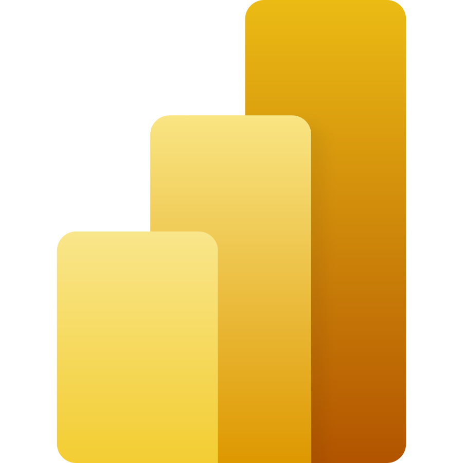
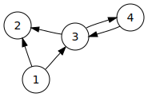

Baantjes strekken met PowerBI, D3 en een Direct Follow Graph
------------------------------------------------------------

# Intro
Ik wil graag iets vertellen over hoe ik begin vorige jaar verwikkeld ben raakte in het [**Fellowmining**](https://www.fellowmindcompany.com/nl-nl/oplossingen/data-en-ai/fellowmining/) project. 

Op de relatief onschuldige vraag of ik data dynamisch zou kunnen visualiseren met behulp van PowerBI API in combinatie met React, antwoorden ik: "vast wel". 

Inmiddels Inmiddels een jaar verder heb ik met behulp van de PowerBI API, D3.js framework, React en veel JS/TS versie 2.0 opgeleverd van de Fellowmining swimminglane visual.

Het probleem waar het Fellowmining project team tegen aan liep was dat zij het, met de beschikbare middelen bronnen, niet voor elkaar kregen de data in PowerBI weer tegen als een zgn. _swimming lane graph_. Zelf maken was in dit geval de beste optie. 

Over hoe ik dat heb gedaan en wat ik daarvan heb geleerd wil ik graag e.e.a. vertellen.

# Lets get started
De uitdaging bestond uit drie delen, nl.: 

1. Data conversie
2. Visualiseren
3. Implementatie 

## Data conversie
Voor het te kunnen weergegeven van een zgn. _swimming lane graph_ was de eerste stap  het omzetten van de data afkomstig uit PowerBI naar een meer bruikbaar data type, een [Directed graph](https://en.wikipedia.org/wiki/Directed_graph).

PowerBI kent het datatype _graph_ niet als type dat out-of-the-box kan worden gebruikt door custom visuals. Wat de custom visual ontvangt is JSON object waarin de data, afhankelijk van de zgn. [_data view mapping_](https://learn.microsoft.com/en-us/power-bi/developer/visuals/dataview-mappings), word aangeboden als bijvoorbeeld _categories_ & _values_ (bij categorical), of als _columns_ & _rows_ (bij tables).

Voor Fellowmining hebben we ervoor gekozen om alle data als **table data view mapping** in te laden. Dit betekend alle individuele regels, met een minimale groepering, worden aangeboden en kunnen worden verwerkt. Dit geeft de vrijheid om o.b.v. alle variaties van de data een graph te maken.

De table data moet eerst worden gesorteerd zodat de regels op event volgorde staan binnen eventuele varianten. Daarna kunnen de unieke _nodes_ worden bepaald. Tegelijkertijd kan de _edges_, relatie tussen de nodes, worden bepaald. Door naar de de volgende en vorige regel te kijken word naast de _edge_ ook eventuele metadata verzameld zoals frequentie en doorloop duur.

> Voor Fellowmining zag dat er als volgt uit voor variant [ABCPRRSUWKYJ](./assets/graph_ABCPRRSUWKYJ.json).

## Visualiseren
Nu dat de data is gevormd in een graph data type, kunnen we aan de slag met het visualiseren daarvan. Hiervoor kan bijvoorbeeld [Graphviz](https://graphviz.org/) gebruikt worden. Los van dat deze oplossing niet onmiddellijk de swimming lane graph aanbied, is Graphviz gebruiken in combinatie met PowerBI niet vanzelfsprekend mogelijk. Microsoft's PowerBI zelf draagt de [D3.js library](https://d3js.org/) aan. Hiermee kan data in combinatie met React en de [PowerBI-visuals tools API](https://github.com/microsoft/PowerBI-visuals-tools) relatief eenvoudig worden gevisualiseerd. 

D3.js is een library/framework dat het Document Object Model ([DOM](https://en.wikipedia.org/wiki/Document_Object_Model)) kan manipuleren o.b.v. data. Ofwel D3.js kan op een relatief makkelijke manier web pagina elementen en haar attributen aanpassen, toevoegen of verwijderen. Dit framework is dermate buitengewoon compleet en maakt visualiseren van eigenlijk alles mogelijk. Je moet het alleen wel zelf maken!

> **DEMO** data omzetten naar swimminglane 

## Implementatie
De implementatie van de visualisatie is een onderwerp op zich, en daarom buiten scope van deze blob/presentatie.

De implementatie van de visual is inmiddels afgerond en maakt volwaardig deel uit van het Fellowmining dashboard. Zoals je kan zien is worden er meerdere lagen data getoond en kan er intuïtief de wijze van weergave worden aangepast.

> **DEMO** https://app.powerbi.com/groups/20648402-4562-4bbb-9eeb-86be833b4b13/reports/ee772492-914e-4c95-8f0c-0f78074f2656/ReportSection9764169404145b00709c

# Hoe nu verder
Als je zelf ook een custom visual wil maken voor PowerBI dan raad ik aan te starten op één van de volgende sites:

* [Power BI visuals documentation](https://learn.microsoft.com/en-us/power-bi/developer/visuals/)
* [Developing Your First PowerBI Visual](https://github.com/PowerBi-Projects/PowerBI-visuals)
* [PowerBI-visuals tools API](https://github.com/microsoft/PowerBI-visuals-tools)

Er is voldoende documentatie maar niet altijd even duidelijk. Hoogoven word alles goed uitgelegd maar als je meer informatie zoekt over een specifieke instelling dan moet je goed doorzoeken of vragen gaan stellen.

Tijdens het ontwikkelen van de visual voor Fellowmining viel al op dat het team achter de **PowerBI-visuals tools API** niet stil zit. Het is daarom sterk aan te raden om ontwikkelingen in de gaten en release notes eerst te lezen als bijvoorbeeld de build pipelines het niet meer doen. 

# Sheets
